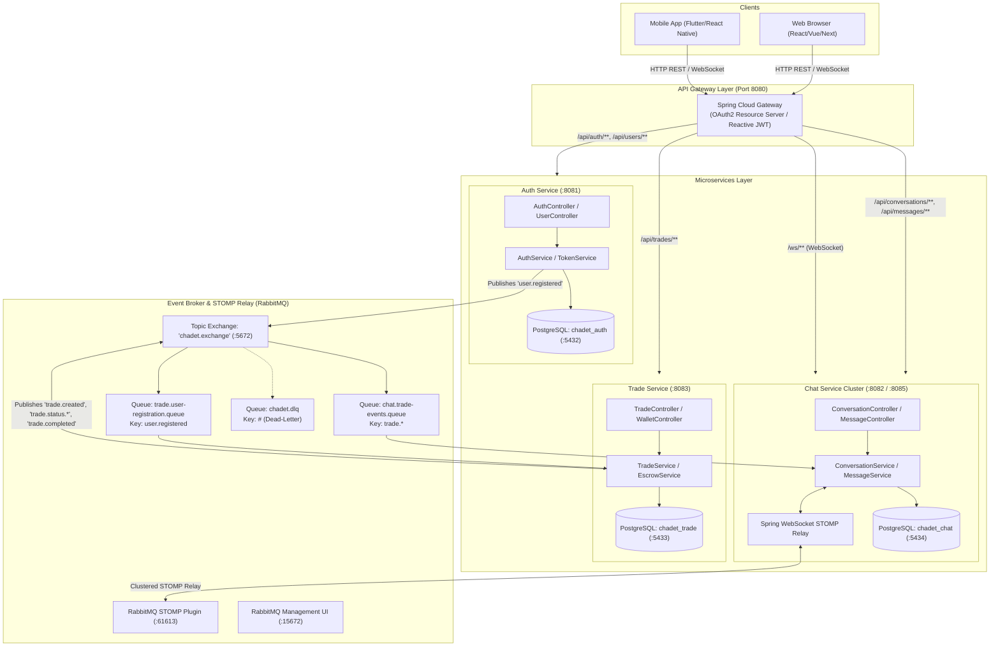
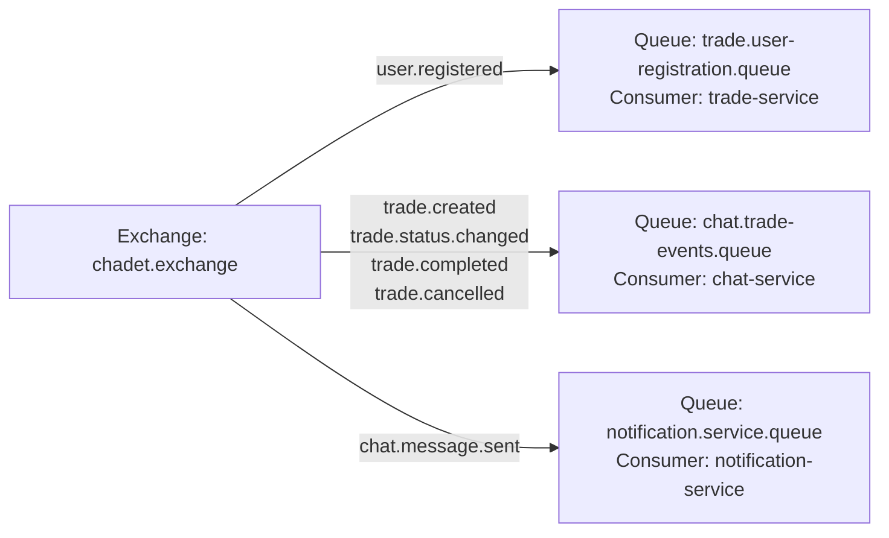
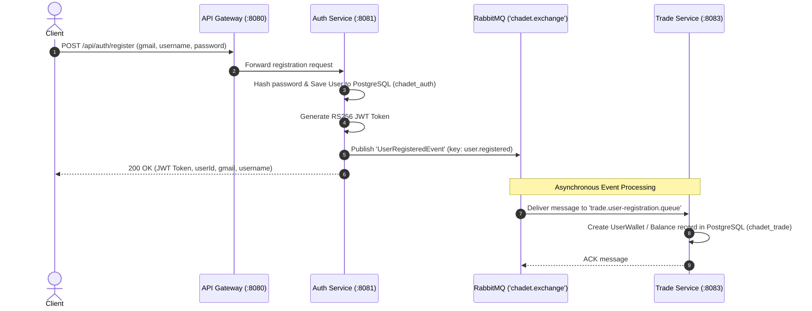
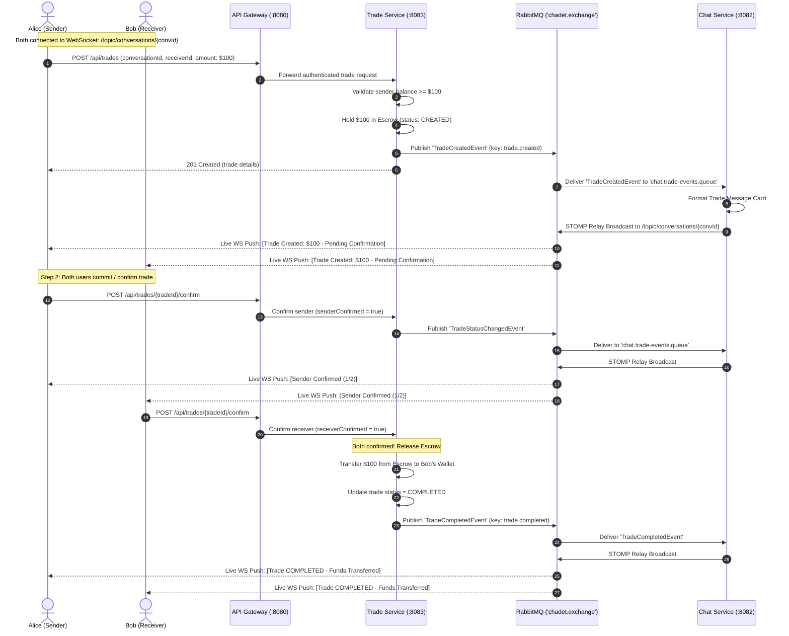
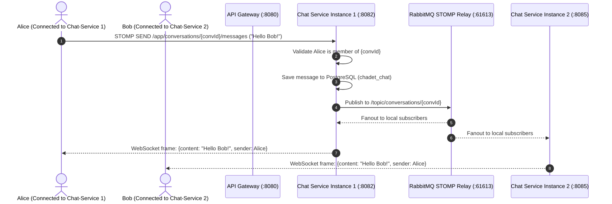

# Chadet System Architecture & Event-Driven Business Logic

This document provides a comprehensive technical guide to Chadet's **Microservices Architecture**, **Event-Driven Communication (EDA) via RabbitMQ**, **Distributed WebSocket STOMP Messaging**, and **Core Business Workflows** (Chat, Escrow Trading, Authentication).

---

## 1. High-Level Architecture Overview

Chadet is designed around four decoupled services adhering to the **Database-per-Service** and **Event-Driven Architecture (EDA)** patterns, with an **API Gateway** acting as the single client entrypoint and **RabbitMQ** orchestrating asynchronous domain events and distributed WebSocket fanout.



---

## 2. Communication Protocols & Patterns

| Flow | Protocol | Mechanism | Purpose |
| :--- | :--- | :--- | :--- |
| **Client to Gateway** | HTTP/2 & WebSocket | Synchronous REST & WSS | User requests, initial STOMP connection, API queries |
| **Gateway to Services** | HTTP & WebSocket | Reverse Proxy & Routing | Path routing (`/api/auth`, `/api/conversations`, `/api/trades`) |
| **Inter-Service Events** | AMQP 0-9-1 | Asynchronous Topic Exchange (`chadet.exchange`) | Decoupled cross-service state propagation (`user.registered`, `trade.*`) |
| **Real-time Chat Fanout** | STOMP over WebSocket | RabbitMQ STOMP Broker Relay | Subscriptions to `/topic/conversations/{id}` scaled across multiple service instances |

---

## 3. RabbitMQ Topology & Event Schemas

### 3.1 Exchange and Queue Configuration

- **Exchange**: `chadet.exchange` (Type: `TopicExchange`, Durable: `true`)
- **Dead Letter Exchange**: `chadet.dlx` (Type: `FanoutExchange`, Queue: `chadet.dlq`)



### 3.2 Event Data Contracts (JSON)

#### A. `UserRegisteredEvent` (Routing Key: `user.registered`)
```json
{
  "eventId": "a50c822e-e722-49da-a664-df820a4843b1",
  "eventType": "USER_REGISTERED",
  "userId": "b47c9451-3652-4752-9b2c-293e4e9a06fa",
  "gmail": "alice@gmail.com",
  "username": "alice",
  "timestamp": "2026-08-12T14:00:00Z"
}
```

#### B. `TradeCreatedEvent` (Routing Key: `trade.created`)
```json
{
  "eventId": "c71f92e8-d144-4860-93cb-64bc63b65ef3",
  "eventType": "TRADE_CREATED",
  "tradeId": "f10e427d-9988-4c12-8877-0123456789ab",
  "conversationId": "e22a4561-8899-4c12-9988-1234567890cd",
  "creatorId": "b47c9451-3652-4752-9b2c-293e4e9a06fa",
  "senderId": "b47c9451-3652-4752-9b2c-293e4e9a06fa",
  "receiverId": "d33b5672-1122-4a33-8844-3456789012ef",
  "amount": 100.00,
  "status": "CREATED",
  "timestamp": "2026-08-12T14:05:00Z"
}
```

#### C. `TradeStatusChangedEvent` (Routing Key: `trade.status.changed`)
```json
{
  "eventId": "d82a13f9-e255-4971-a4dc-75cd74c76fa4",
  "eventType": "TRADE_STATUS_CHANGED",
  "tradeId": "f10e427d-9988-4c12-8877-0123456789ab",
  "conversationId": "e22a4561-8899-4c12-9988-1234567890cd",
  "status": "CONFIRMED_BY_SENDER",
  "senderConfirmed": true,
  "receiverConfirmed": false,
  "timestamp": "2026-08-12T14:06:30Z"
}
```

#### D. `TradeCompletedEvent` (Routing Key: `trade.completed`)
```json
{
  "eventId": "e93b24a0-f366-4a82-b5ed-86de85d87ab5",
  "eventType": "TRADE_COMPLETED",
  "tradeId": "f10e427d-9988-4c12-8877-0123456789ab",
  "conversationId": "e22a4561-8899-4c12-9988-1234567890cd",
  "senderId": "b47c9451-3652-4752-9b2c-293e4e9a06fa",
  "receiverId": "d33b5672-1122-4a33-8844-3456789012ef",
  "amount": 100.00,
  "status": "COMPLETED",
  "completedAt": "2026-08-12T14:07:00Z"
}
```

---

## 4. Core Business Logic & Workflow Sequence Diagrams

### 4.1 Workflow 1: User Registration & Asynchronous Wallet Initialization

When a user signs up, `auth-service` persists credentials and emits a `UserRegisteredEvent`. `trade-service` consumes this event asynchronously and initializes a dedicated wallet ledger with zero synchronous coupling between the two services.



---

### 4.2 Workflow 2: In-Chat Realtime Escrow Trade Lifecycle

This workflow demonstrates how Chadet acts as a reliable **Man-in-the-Middle (Escrow)** during transactions between users in a chat conversation:

1. **Trade Creation & Escrow Hold**: Sender creates a trade; `trade-service` locks the sender's balance in escrow and publishes `TradeCreatedEvent`.
2. **In-Chat Interactive Widget**: `chat-service` consumes `TradeCreatedEvent` and pushes a live trade widget into the WebSocket topic `/topic/conversations/{id}`.
3. **Two-Party Confirmation**:
   - Both parties must confirm.
   - If both confirm (`senderConfirmed = true` and `receiverConfirmed = true`), `trade-service` releases the escrow balance to the receiver and publishes `TradeCompletedEvent`.
4. **Dispute / Cancellation**:
   - If either party denies/cancels before completion, `trade-service` holds/refunds the balance and emits `TradeCancelledEvent`.



---

### 4.3 Workflow 3: Real-Time Chat Messaging & Multi-Instance WebSocket Scaling

When `chat-service` is scaled horizontally across multiple containers/nodes, RabbitMQ's STOMP broker relay guarantees that all users receive messages regardless of which server instance they are connected to:



---

## 5. Security & Authentication Architecture

1. **Asymmetric Cryptography (RSA SHA-256)**:
   - `auth-service` holds the RSA **Private Key** and signs JWTs upon user login/registration.
   - `gateway-service`, `chat-service`, and `trade-service` hold the corresponding **Public Key** to independently decode and verify JWTs without network calls to `auth-service`.
2. **Gateway Guard**:
   - `gateway-service` rejects invalid tokens (`401 Unauthorized`) at the edge before requests reach internal services.
3. **WebSocket Security**:
   - On STOMP `CONNECT`, the `AuthChannelInterceptor` extracts `Authorization: Bearer <token>`, decodes the claims using `JwtDecoder`, and binds the authenticated user principal to the session.

---

## 6. Service Ports & Infrastructure Summary

| Component | Port | Description |
| :--- | :--- | :--- |
| **API Gateway** | `8080` | Entrypoint for all REST and WebSocket clients |
| **Auth Service** | `8081` | Authentication, user registration, JWT issuer |
| **Chat Service** | `8082` | Conversations, messages, STOMP endpoint `/ws` |
| **Trade Service** | `8083` | Escrow trades, wallet ledger, confirmation states |
| **RabbitMQ AMQP** | `5672` | Event exchange and queue communications |
| **RabbitMQ Management**| `15672` | Visual web console dashboard |
| **RabbitMQ STOMP** | `61613` | Distributed WebSocket STOMP broker relay |
| **PostgreSQL (Auth)** | `5432` | Database: `chadet_auth` |
| **PostgreSQL (Trade)** | `5433` | Database: `chadet_trade` |
| **PostgreSQL (Chat)** | `5434` | Database: `chadet_chat` |
