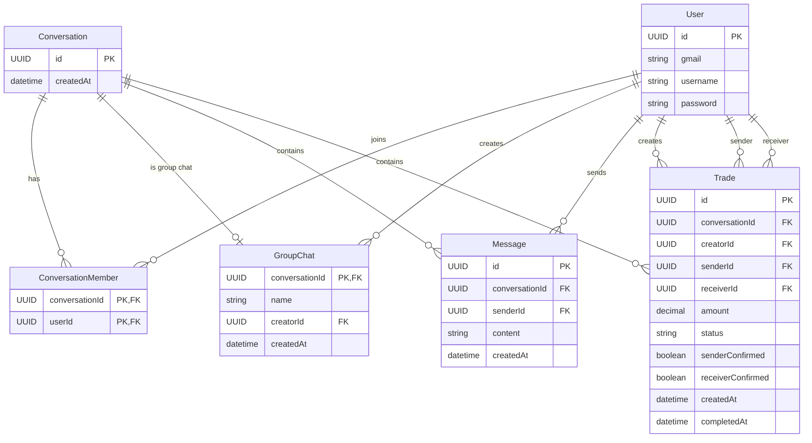

- User can chat realtime with other through websocket with others 
- User can create a trade between them, our app will become a man in the middle, reliable, holding the balance when the transaction begin, after the progress is done
	- two of user commited, we will transfer the balance to sender 
	- one of them denied, hold the balance
    - create group chat 

4 service: 
                    ┌──────────────┐
                    │   API Gateway│
                    └──────┬───────┘
                           │
          ┌────────────────┼────────────────┐
          ▼                ▼                ▼
   ┌─────────────┐  ┌─────────────┐  ┌─────────────┐
   │ User/Auth   │  │ Chat Service│  │ Trade       │
   │ Service   │  │             │  │ Service     │
   └─────────────┘  └─────────────┘  └─────────────┘